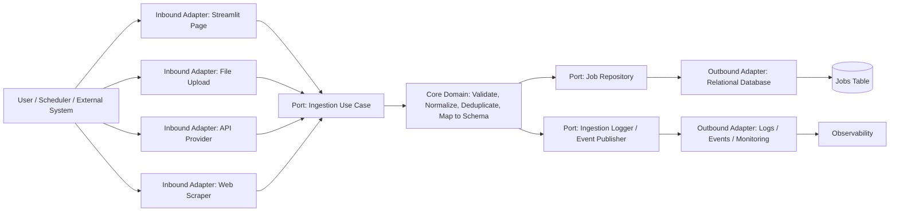
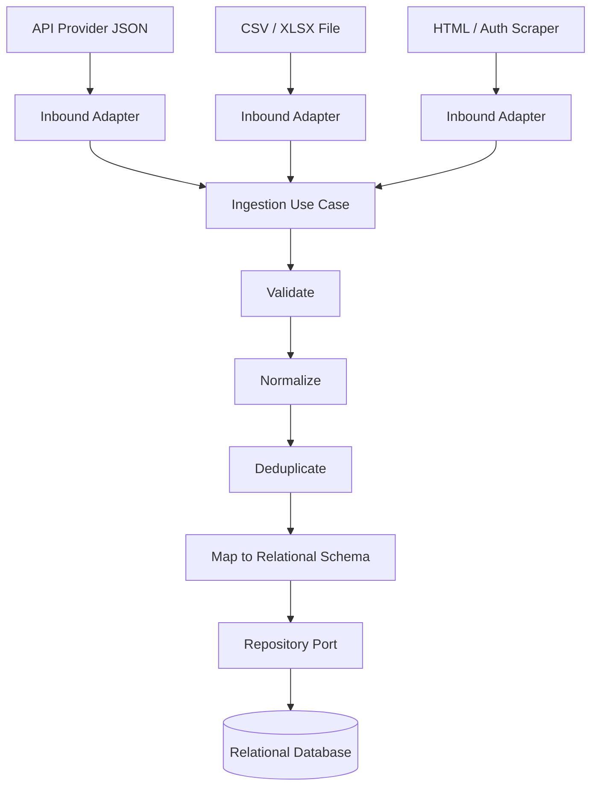
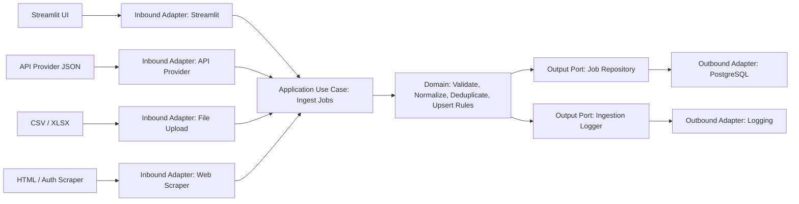
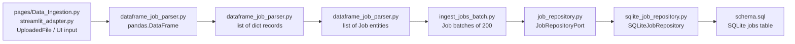
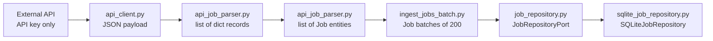
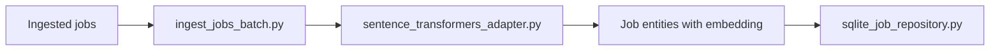

## resume-to-job-2.0

## Introduction

This is an application leverage the usage of LLMs to help job seekers to find the best job for them. The application is built using Streamlit, a popular framework for creating interactive web applications in Python. The main goal of this application is to provide a user-friendly interface that allows users to input their resume and receive personalized job recommendations based on their skills, experience, and preferences.


## Stacks

- Python
- Streamlit
- PostgreSQL
- Prisma

## Architecture

Implementing a hexagonal architecture, the application is structured into three main components:

1. **Core Business Logic**: This is the domain center. It should contain the rules for job ingestion, validation, normalization, deduplication, schema mapping, and upsert decisions. It must not know whether the data came from an API, a CSV file, or a scraper.

2. **Ports**: These are the contracts the core depends on. In this project, the important ports are the job repository port, the ingestion source port, and the notification/logging port. The core calls these interfaces; it does not call databases or external APIs directly.

3. **Adapters**: These are the concrete implementations around the core. They translate the outside world into the core's language and translate core output into external systems like a relational database, a REST API, a file parser, or a scraper.

### Hexagonal Mapping



### Ingestion Flow



### Detailed Layer Mapping

#### Core business

- Job entity and value objects
- Validation rules for job records
- Normalization rules for titles, companies, locations, and timestamps
- Deduplication rules for repeated jobs
- Upsert decision logic for insert vs update
- Schema mapping from the domain model to the database model

#### Ports

- `JobIngestionUseCase`: receives a batch or single job record and orchestrates the ingestion flow
- `JobRepository`: defines `upsert`, `find`, and `exists` operations for the relational database
- `JobSource`: defines how a source provides jobs to the core
- `IngestionLogger`: defines how ingestion results are reported

#### Adapters

- Streamlit UI page: starts ingestion manually and shows results
- File upload adapter: reads CSV or XLSX and converts rows into domain input
- API adapter: reads JSON from an external provider and converts it into domain input
- Web scraping adapter: extracts HTML data and converts it into domain input
- SQL repository adapter: writes the final job data into the relational database

### How Your Three Ingestion Paths Fit

1. **API provider**: `JSON -> API adapter -> ingestion use case -> repository port -> database adapter`

2. **File upload**: `.csv / .xlsx -> file adapter -> ingestion use case -> repository port -> database adapter`

3. **Web scraping**: `HTML -> scraper adapter -> ingestion use case -> repository port -> database adapter`

### What Should Stay in the Core

The core should own the business decisions only. For this project, that means the core decides how a job is cleaned, validated, matched to the schema, and upserted. The core should not know about Streamlit, Pandas, HTTP clients, browser scraping, or SQLite details.

### What Should Stay Outside the Core

Anything that depends on the outside world belongs in an adapter: user interface, file parsing, network calls, scraping, database access, and logging infrastructure.


## How to run streamlit app

```bash
pip install -r requirements.txt
streamlit run app.py
```

## Pages in Streamlit

Pages can be found in the `pages` folder, which contains different Python files representing different pages of the Streamlit application. Each file corresponds to a specific page, and the content of each page is defined within its respective file. The main `app.py` file serves as the entry point for the Streamlit application, and it can include navigation logic to switch between different pages based on user interactions.


## Data ingestion

Upserting job data into the database can be achieved through three main methods:

1. API provider (UnAuth) - JSON -> data ingestion adapters -> application use case -> domain rules -> repository adapter -> PostgreSQL

2. File upload (UnAuth) -.csv/.xlsx -> data ingestion adapters -> application use case -> domain rules -> repository adapter -> PostgreSQL

3. Web scraping (Auth) - HTML -> data ingestion adapters -> application use case -> domain rules -> repository adapter -> PostgreSQL

### Data Ingestion Folder Tree

```text
src/
	domain/
		entities/
		value_objects/
		services/
	application/
		use_cases/
		dto/
	ports/
		input/
		output/
	adapters/
		inbound/
			streamlit/
			api_provider/
			file_upload/
			web_scraper/
		outbound/
			persistence/
			logging/
```

### Hexagonal View of Data Ingestion



In this section, your "data processing" is split into two parts:

- **Adapters**: read and translate API, file, HTML, or UI input into a common structure.
- **Application and domain**: orchestrate the ingestion flow and enforce the business rules.

This split keeps the database choice and the input format separate from the business rules.

### What each folder does

- `domain/entities`: job and ingestion business objects
- `domain/value_objects`: small validated fields such as job title, company name, location, and source
- `domain/services`: pure business rules that do not fit inside a single entity
- `application/use_cases`: ingestion orchestration
- `application/dto`: input and output models for the use case
- `ports/input`: interfaces the UI or adapters call
- `ports/output`: interfaces the core uses to save data or emit logs
- `adapters/inbound/*`: Streamlit, API, file, and scraper entry points
- `adapters/outbound/persistence`: SQLite implementation for local testing
- `adapters/outbound/logging`: logging or monitoring implementation

### 1. Data Route and Types for File Upload Ingestion



The type or abstraction changes at each step:

1. UI or uploaded file object -> `UploadedFile` or widget input in `pages/Data_Ingestion.py` or `streamlit_adapter.py`
2. Parsed table -> `pandas.DataFrame` in `dataframe_job_parser.py`
3. Normalized rows -> `list[dict[str, object]]` in `dataframe_job_parser.py`
4. Domain objects -> `list[Job]` in `dataframe_job_parser.py`
5. Batch abstraction -> `Job` chunks of `200` in `ingest_jobs_batch.py`
6. Output port -> `JobRepositoryPort` in `job_repository.py`
7. Concrete adapter -> `SQLiteJobRepository` in `sqlite_job_repository.py`
8. Storage -> SQLite table rows defined by `schema.sql`


### 2. Data Route and Types for API Provider Ingestion

This route is the next planned inbound path. It should use an API key only,
without user authentication, and it should reuse the same ingestion use case
and repository port as the file-upload route.



The type or abstraction changes at each step:

1. External request -> `API key`-protected HTTP call in `api_client.py`
2. Provider response -> `JSON payload` in `api_client.py`
3. Parsed payload -> `list[dict]` in `api_job_parser.py`
4. Domain objects -> `list[Job]` in `api_job_parser.py`
5. Batch abstraction -> `Job` chunks of `200` in `ingest_jobs_batch.py`
6. Output port -> `JobRepositoryPort` in `job_repository.py`
7. Concrete adapter -> `SQLiteJobRepository` for local testing
8. Storage -> rows in the jobs table

Notes for the API route:

- Keep the API key in environment variables or Streamlit secrets.
- Do not move API authentication into the domain layer.
- Map provider-specific JSON into the same `Job` model used by the file route.
- Reuse `IngestJobsBatchUseCase` so both routes follow the same core logic.

Notes for the API route:

Implementation notes:
- Inbound HTTP client: `src/adapters/inbound/api_provider/api_client.py` fetches JSON from provider endpoints (API key via env var or UI input).
- Parser: `src/adapters/inbound/api_provider/api_job_parser.py` maps provider JSON (e.g., ArbeitNow) into `list[dict]` records and converts to `list[Job]`.
- Tolerance: parser collects per-record validation errors using the tolerant methods in the dataframe parser (`to_jobs_with_errors_from_records`) so invalid rows are reported but valid rows can still be ingested.
- UI: `src/adapters/inbound/streamlit/streamlit_adapter.py` exposes an "API endpoint" ingestion option (enter endpoint + API key), previews parsed records, shows a table of invalid rows when present, and calls `IngestJobsBatchUseCase` to persist valid jobs.
- Persistence: default local store is SQLite via `src/adapters/outbound/persistence/sqlite_job_repository.py` (DB file: `data/jobs.db`). The repo implements `upsert_many()` and a convenience `count()`.
- Raw payload: parser keeps the original record under the `raw` key to aid debugging; you may drop or persist it based on your needs.

Quick test / housekeeping commands:

Create DB and run demo insertion (inserts two demo jobs):
```bash
./.venv/Scripts/python.exe - <<'PY'
from src.adapters.inbound.streamlit.streamlit_adapter import run_demo
run_demo()
PY
```

Clear the `jobs` table:
```bash
python testing/scripts/clear_jobs_table.py
```

Default DB location can be overridden with `JOB_DB_PATH` environment variable or by changing `JOB_DB_PATH` in the Streamlit UI config.

#### API source: https://www.arbeitnow.com/blog/job-board-api (test)

The API endpoint: `https://www.arbeitnow.com/api/job-board-api`  

## Data embeddings and Similarity Search

### 1. Data Embeddings

The current application generates embeddings from the job `description` field after ingestion starts. This is handled in the application layer so both CSV and API routes follow the same rule set.



The type or abstraction changes at each step:

1. Ingested input -> `list[Job]`
2. Embedding input -> each job `description`
3. Embedding service -> `SentenceTransformersEmbeddingAdapter`
4. Embedding output -> `list[list[float]]`
5. Enriched jobs -> `Job` entities with `embedding`
6. Storage -> SQLite `jobs` table with an `embedding` JSON column

Current rules:

- `description` is mandatory.
- Records without `description` are discarded before embedding.
- The UI only triggers ingestion.
- The use case owns the embedding call, so the same behavior is reused across inbound adapters.

Implementation details:

- Embedding adapter: `src/adapters/outbound/embedding/sentence_transformers_adapter.py`
- Application use case: `src/application/use_cases/ingest_jobs_batch.py`
- Database field: `embedding` in `src/adapters/outbound/persistence/sqlite_job_repository.py`

### 2. PDF resume parsing