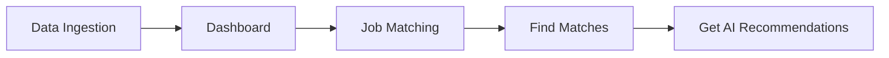
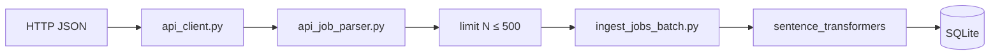
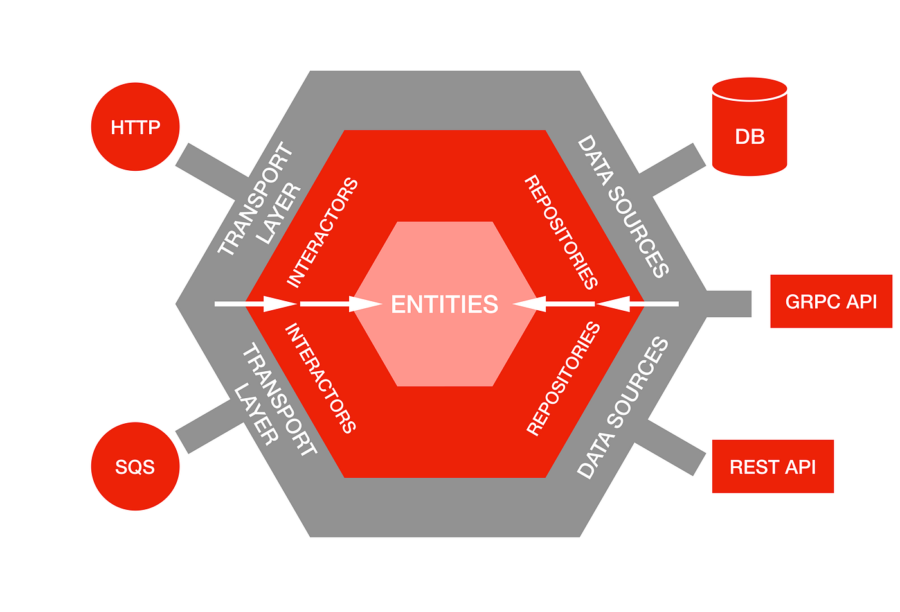

# resume-to-job-2.0

Streamlit application that ingests job listings, embeds descriptions with a local model, ranks jobs against a resume (cosine similarity), and optionally scores the resume plus top job picks via an OpenAI-compatible LLM API (e.g. Google Gemini).

**Version line:** `2.0` (see `APP_VERSION` / home page). Planned releases: `2.1`, `2.2`, … as features and deployment mature.

---

## Current features (2.0)

| Area | Status |
|------|--------|
| **Data Ingestion** | CSV upload; API fetch with configurable limit (up to **500** jobs) |
| **Embeddings** | `all-MiniLM-L6-v2` on job `description` at ingest time |
| **Dashboard** | KPIs + job table, **10 jobs per page** with Previous/Next |
| **Job Matching** | PDF resume → cosine **Find Matches** → **Get AI Recommendations** on filtered jobs only |
| **Observability** | JSON logs on ingest / match / AI ([testing/OBSERVABILITY.md](testing/OBSERVABILITY.md)) |
| **Offline eval** | `testing/scripts/pipeline_eval.py` |
| **Storage** | SQLite (`data/jobs.db` by default) |
| **Container deploy** | Scaffolding only — [DEPLOYMENT.md](DEPLOYMENT.md) |
| **Resume Builder** | Removed from scope |
| **Web scraper / PostgreSQL** | Documented as future / alternate adapters |

---

## Quick start

```bash
pip install -r requirements.txt
streamlit run app.py
```

Open http://localhost:8501 and use the sidebar:

1. **Data Ingestion** — load jobs  
2. **Dashboard** — verify stored jobs  
3. **Job Matching** — resume upload, match, AI recommendations  

---

## User workflow



### Data Ingestion

- **CSV:** columns `id`, `title`, `company`, `description` (required); optional `location`, `source`.  
- **API:** endpoint + optional API key. Choose **how many jobs to load** (1–**500**, default **500**). The client **follows pagination** when the provider exposes a next page (e.g. Arbeitnow returns ~**100 jobs per page**). Invalid rows (e.g. missing description) are reported and skipped.  
- **Ingest:** embeds all loaded valid jobs, then saves to SQLite in **write batches of 200** (see [Ingest batch size](#ingest-batch-size) below).

Test API (ArbeitNow): `https://www.arbeitnow.com/api/job-board-api`

### Dashboard

- Metrics: total jobs, with / without embeddings.  
- Paginated table: 10 rows per page, **Previous page** / **Next page**.

### Job Matching

1. Upload PDF resume (text + embedding extracted).  
2. Set cosine shortlist size → **Find Matches**.  
3. **Get AI Recommendations** (requires API key in UI or env) — AI only sees jobs from step 2; up to 3 recommendations (fewer if shortlist &lt; 3).

**Google AI Studio:** set API base to `https://generativelanguage.googleapis.com/v1beta/openai`, model e.g. `gemini-2.0-flash`, key from [aistudio.google.com/apikey](https://aistudio.google.com/apikey). See [Gemini OpenAI compatibility](https://ai.google.dev/gemini-api/docs/openai).

---

## Configuration

| Variable | Purpose | Default |
|----------|---------|---------|
| `JOB_DB_PATH` | SQLite file | `data/jobs.db` |
| `API_JOB_LIMIT` | Default API fetch limit in UI | `500` |
| `JOB_API_KEY` | Optional key for job board API | — |
| `AI_API_KEY` / `GEMINI_API_KEY` | LLM recommendations | — |
| `AI_API_BASE` | OpenAI-compatible base URL | OpenAI or Gemini URL in UI |
| `AI_MODEL` | Model name | `gpt-4o-mini` / `gemini-2.0-flash` in UI |
| `APP_VERSION` | Shown on home (Docker build arg) | `dev` |
| `LOG_LEVEL` | Structured log level | `INFO` |

Copy [.env.example](.env.example) to `.env` for local overrides.

---

## Ingest batch size

`IngestJobsBatchUseCase` uses **batch size 200** for **SQLite writes only**:

- All unique jobs in one ingest run are **embedded in a single** `embed_texts` call.  
- Jobs are then saved with `upsert_many` in chunks of 200 (e.g. 500 jobs → 3 DB batches: 200 + 200 + 100).  
- There is **no** 200-job cap on how many jobs you can ingest.

---

## Observability and evaluation

- **Runtime:** JSON line logs from use cases (ingest, match, AI).  
- **Offline:** `python testing/scripts/pipeline_eval.py` (optional `--run-ai` if API key set).  

Details: [testing/OBSERVABILITY.md](testing/OBSERVABILITY.md)

```bash
python testing/scripts/clear_jobs_table.py
python testing/scripts/pipeline_eval.py
```

Sample fixtures: `testing/sample_data/sample_jobs.csv`, `sample_resume.txt`.

---

## Architecture (hexagonal)

```text
pages/ (Streamlit)  →  adapters/inbound/streamlit|api_provider|file_upload
                    →  application/use_cases
                    →  domain/entities|services
                    →  ports/output
                    →  adapters/outbound/persistence|embedding|llm|logging
```

**Implemented outbound adapters:** SQLite job repository, Sentence Transformers embeddings, OpenAI-compatible LLM, structured logging.

**Planned:** web scraper inbound, PostgreSQL/Prisma (README legacy), full Kubernetes operations.

### API ingestion path



---

## Project layout

```text
app.py                 # Home + logging setup
pages/                 # Data_Ingestion, Dashboard, Job_Matching
src/
  domain/              # Job, Resume, similarity, Recommendation
  application/use_cases/
  ports/output/
  adapters/inbound/      # streamlit, api_provider, file_upload
  adapters/outbound/     # persistence, embedding, llm, logging
data/jobs.db             # Created at runtime (gitignored)
testing/                 # scripts, sample_data, output reports
Dockerfile               # Planned deployment (see DEPLOYMENT.md)
```

---

## Container deployment (planned)

Docker files support **2.0 → 2.1 → 2.2** image tags when the app is ready to ship. Not required for local development. See [DEPLOYMENT.md](DEPLOYMENT.md).

---

## Roadmap

- **2.0 (current):** ingest, dashboard, cosine match, filtered AI recommendations, logging, eval script.  
- **2.1+:** container release, optional metrics export, PostgreSQL or scraper if required by rubric.  
- **Later:** Kubernetes (same image), richer monitoring (Prometheus/MLflow) if needed.

---

## Legacy design notes

Older sections in git history described PostgreSQL, Prisma, Resume Builder, and three ingestion paths including scraping. The running app uses **SQLite** and the flows documented above; PostgreSQL and scraper remain architectural targets, not the current runtime.


